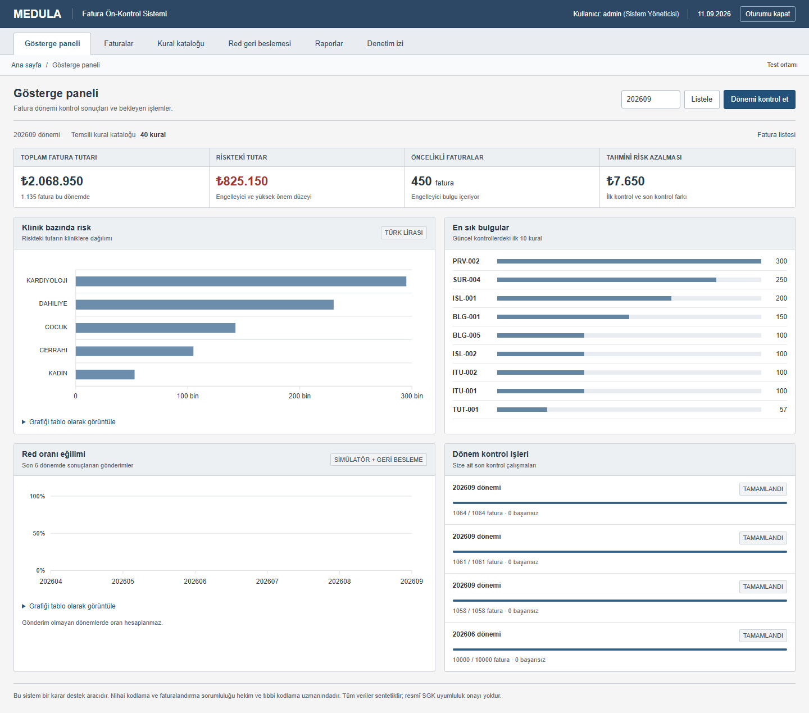

# MEDULA Ön Kontrol

Hastane faturalarını gönderimden önce incelemek için geliştirilmiş bir .NET uygulaması. Fatura kalemlerini 40 sürümlü kuralla kontrol eder; bulguları, gerekçelerini ve riskteki tutarı gösterir. Red geri bildirimlerinden kural bazında precision, recall ve F1 hesaplar.

Veriler sentetiktir. MEDULA gönderimi ve elektronik imza simüle edilir; kural kataloğu gerçek SUT hükümlerini uygulamaz. Bu proje gerçek hasta verisi için hazırlanmış bir üretim sistemi değildir.



## Çalıştırma

Linux konteyner desteği olan Docker ve Docker Compose 2.20+ gerekir. Depoyu klonlayın veya ZIP olarak indirip açın. Proje kökünde:

```sh
docker compose up -d --build
```

Oracle'ın ilk açılışı birkaç dakika sürebilir. Uygulama [localhost:5187](http://localhost:5187) adresindedir. Şema, kural kataloğu ve üç dönemlik örnek veri ilk kurulumda yüklenir.

Kullanıcı adı `admin`; başlangıç parolası kurulumda üretilir. PowerShell ile:

```powershell
New-Item -ItemType Directory -Force secrets
docker compose cp web:/run/medula-secrets/admin-password secrets/docker-admin-password
Get-Content secrets/docker-admin-password
```

Giriş yaptıktan sonra **Faturalar** sayfasında bir kayıt açıp **Kontrol et** düğmesine basın. Bulguların birine tıklayarak ilgili kalemi inceleyebilirsiniz. Düzeltme, onay ve rapor adımları [kullanım rehberindedir](docs/usage.md).

## Rehberler

| Yapmak istediğiniz | Belge |
|---|---|
| Kurmak, port değiştirmek veya başlangıç hatasını çözmek | [Kurulum ve sorun giderme](docs/getting-started.md) |
| Bir faturayı kontrol etmek, düzeltmek ve rapor almak | [Kullanım rehberi](docs/usage.md) |
| Kodu değiştirmek ve katkıda bulunmak | [Geliştirme ve katkı](CONTRIBUTING.md) |
| Test, performans ölçümü veya çevrimdışı paket çalıştırmak | [Test ve paketleme](docs/testing.md) |
| Veri akışını ve tasarım kararlarını incelemek | [Diyagramlar](docs/diagrams/README.md), [mimari kararlar](docs/architecture-decisions.md) |

## Kod yapısı

ASP.NET Core MVC, Razor, Oracle XE 21c ve Dapper kullanılır. PDF raporları QuestPDF, Excel dosyaları ClosedXML ile oluşturulur. Arayüz bağımlılıkları yerel dosyalardan sunulur.

| Dizin | Sorumluluk |
|---|---|
| `src/MedulaOnKontrol.Domain` | Varlıklar ve saf kural sözleşmeleri |
| `src/MedulaOnKontrol.Application` | Kurallar, servisler ve repository arayüzleri |
| `src/MedulaOnKontrol.Infrastructure` | Oracle erişimi, iş kuyruğu, şifreleme ve raporlama |
| `src/MedulaOnKontrol.Web` | Controller'lar, Razor görünümleri ve oturum yönetimi |
| `db/`, `data/` | Şema betikleri ve başlangıç kural kataloğu |
| `tests/`, `tools/`, `scripts/` | Testler, ölçüm araçları ve geliştirme komutları |

Kurum ve klinik sınırları veri sorgularında uygulanır. Kontrol sonuçları fatura revizyonuna bağlıdır; bir düzeltme yapıldığında yeniden kontrol gerekir. Önceki sonuçlar ve kural sürümleri saklanır. Dönem işleri Oracle'da kalıcı bir kuyruktan yürütülür.

Riskteki tutar aynı kalemi tekrar saymaz ve fatura toplamını aşmaz. Bu değer, tahsilat veya mevzuata uygunluk garantisi değildir. Klinik referanslar birkaç örnek kodla sınırlıdır; gerçek MEDULA, elektronik imza ve LDAP bağlantısı yoktur.

Kural ayrıntıları [katalogda](docs/kural-katalogu.md), kullanıcı yetkileri [erişim matrisinde](docs/yetki-matrisi.md) bulunur.

## Lisans

Kaynak kod [MIT lisansı](LICENSE) altındadır. Üçüncü taraf bileşenler kendi lisans koşullarına tabidir; [bağımlılık ve referans kaynakları](docs/reference-data-and-licenses.md) ayrıca listelenmiştir.
