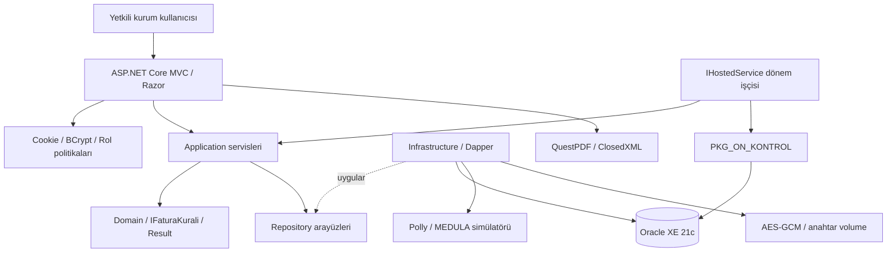
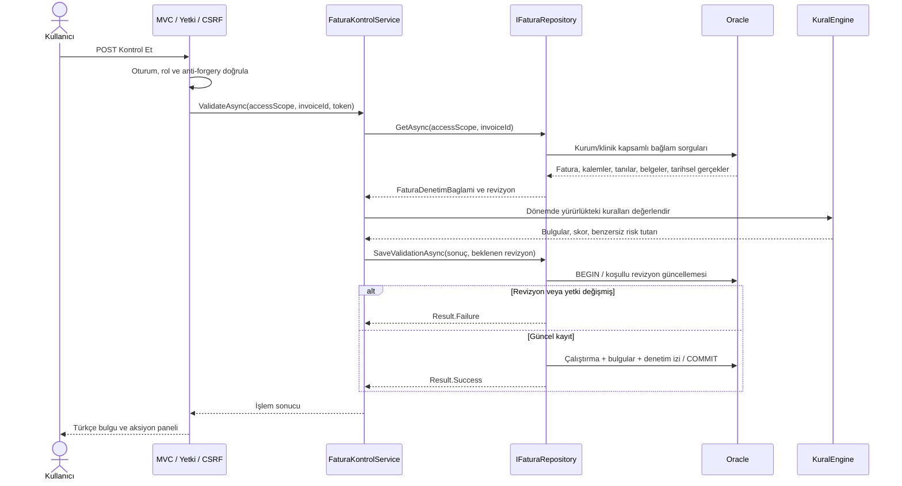
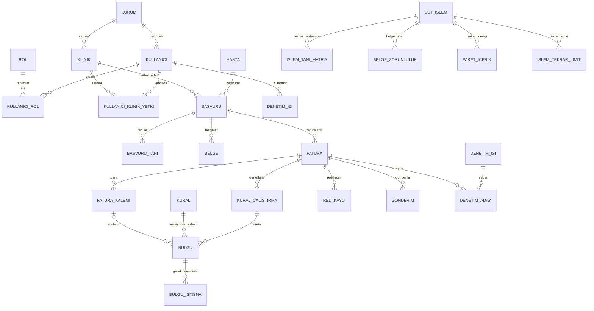
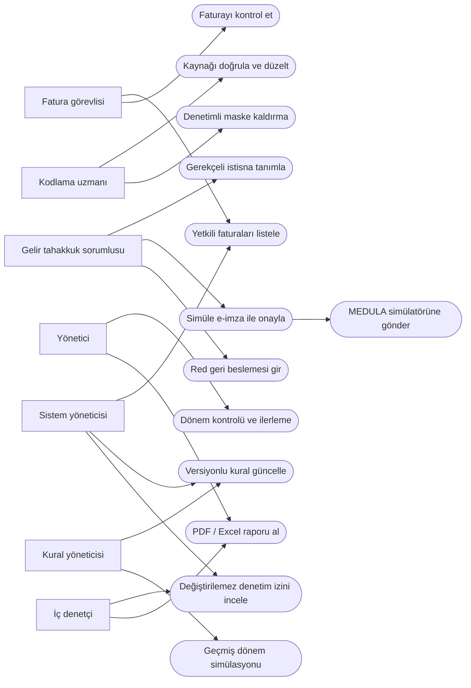

# Veri modeli ve akışlar

Bu sayfa uygulamanın temel akışlarını gösterir. Ayrıntılı davranışlar [mimari kararlar](../architecture-decisions.md), kullanıcı yetkileri [erişim matrisi](../yetki-matrisi.md) içindedir.

## Bileşenler

Web katmanı servisleri çağırır; veri erişimi ve dış sistem simülatörleri Infrastructure katmanındadır.

## Fatura kontrolü

Kontrol sonucu, okunan fatura revizyonu hâlâ güncelse kaydedilir. Eşzamanlı değişiklik eski sonucun kaydedilmesini engeller.

## Veri ilişkileri

Şema ana varlıkları gösterir; bütün sütunları ve kısıtları içermez. Referans kodu ilişkilerinin bir kısmı mantıksaldır. Bilinmeyen veya eski kodların kural motorunca raporlanabilmesi için her işlem ve tanı girişine referans yabancı anahtarı uygulanmaz.

## Rollerin başlıca işlemleri

Bu şema rollerin öne çıkan işlemlerini gösterir; tam yetki listesi değildir. Bütün roller kendi kurum ve klinik kapsamıyla sınırlıdır.

