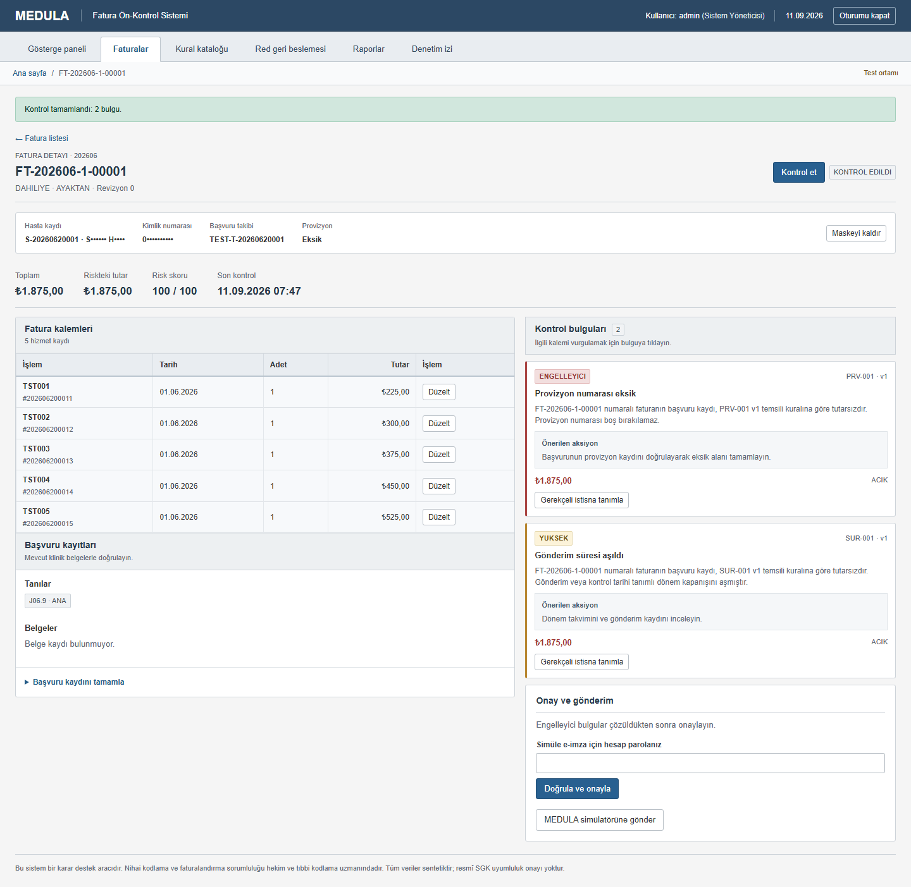

# Kullanım rehberi

[Kurulumu](getting-started.md) tamamladıktan sonra demo verileriyle aşağıdaki akışı deneyebilirsiniz. İlk turda `admin` hesabı bütün ekranları görmenizi sağlar. Diğer rollerin sınırlarını denemek için [hesap tablosuna](yetki-matrisi.md) bakın.

## 1. Dönemi seçin

Girişten sonra **Gösterge paneli** açılır. Dönemler `YYYYMM` biçimindedir; örneğin `202609`, Eylül 2026 anlamına gelir. İlk veri yüklemesi kurulum ayını ve önceki iki ayı oluşturur; her kurulumda aynı aylar bulunmayabilir.

Panelde toplam fatura tutarı, riskteki tutar, bulgu dağılımı ve dönem işleri görünür. **Dönemi kontrol et** seçilen dönem için arka plan işi başlatır. İlerlemeyi dönem işleri bölümünden takip edin. Aynı işlemi tekrar başlatmadan önce mevcut işin durumunu kontrol edin.

## 2. Bir faturayı inceleyin

1. **Faturalar** sayfasını açın ve veri bulunan bir dönem seçin.
2. Klinik, başvuru tipi, durum ve risk aralığı filtrelerini gerekirse daraltın.
3. Fatura numarasına tıklayın.
4. **Kontrol et** düğmesine basın.

Kontrol bittiğinde bulgular sağ tarafta görünür. Her bulgu kural kodunu, önem düzeyini, gerekçeyi ve etkilediği tutarı içerir. Bir kaleme bağlı bulgunun başlığına tıklamak o kalemi tabloda vurgular. Faturanın tamamına ait bulgularda tek bir kalem hedefi yoktur.

Başlangıç verileri bilerek tutarsız kayıtlar içerir. Bir faturada bulgu çıkması, uygulamanın kurulumunun başarısız olduğu anlamına gelmez.

## 3. Kaydı düzeltin ve yeniden kontrol edin

Kalemin **Düzelt** düğmesi işlem kodu, tarih, adet ve fiyat alanlarını açar. Örnek kaydı inceleyin, gerekli alanı değiştirin ve en az 10 karakterlik bir gerekçe yazarak **Düzeltmeyi kaydet** düğmesine basın.

Başvuru düzeyindeki eksikler için **Başvuru kaydını tamamla** bölümünü kullanın. İşlem türü listesinde ana tanı, provizyon, sentetik belge ve fatura toplamı seçenekleri vardır. Bunlar örnek veri üzerinde denemek içindir; ekranın önerileri gerçek klinik kodlama kararı yerine kullanılmaz.

Bir değişiklik fatura revizyonunu artırır. Ekranda güncel kontrol bulunmadığı uyarısı görürseniz **Kontrol et** düğmesine tekrar basın. Önceki bulgular geçmişte tutulur; düzeltme onları geriye dönük değiştirmez.

İki kullanıcı aynı kaydı değiştirirse eski revizyonla gelen işlem reddedilebilir. Sayfayı yenileyip son kaydı inceleyin ve işlemi yeni revizyon üzerinde tekrarlayın.

## 4. Gerekçeli istisnayı deneyin

Gelir sorumlusu, yönetici veya sistem yöneticisi açık bir bulguda **Gerekçeli istisna tanımla** seçeneğini kullanabilir. Gerekçe ve geçerlilik bitişi girin; kaydettikten sonra faturayı yeniden kontrol edin.

İstisna fatura revizyonu, kural sürümü ve ilgili kalemle sınırlıdır. Süresi dolduğunda veya kayıt değiştiğinde aynı onayı taşımaz. Bulguyu silmek için kullanılmaz.

## 5. Onaylayın ve simülatöre gönderin

Güncel kontrolü bulunan ve açık engelleyici bulguları çözülmüş bir faturada onay akışını deneyin. Simüle e-imza alanı, giriş yaptığınız hesabın parolasını doğrular. Gerçek sertifika veya imza cihazı kullanılmaz.

Onaydan sonra simülatöre gönderim yapın. Sonuç kabul veya red olabilir; gönderim dışarıdaki MEDULA sistemine gitmez. Aynı gönderim anahtarı tekrar kullanıldığında simülatör aynı sonucu verir. Gönderilmiş faturanın kontrol geçmişi sonradan değiştirilmez.

Onay veya gönderim reddedilirse ekrandaki gerekçeyi izleyin: güncel kontrol eksikliği, açık engelleyici bulgu, değişmiş revizyon veya süresi dolmuş istisna buna neden olabilir. Ekrandaki düğmenin görünmesi tek başına işlemin yapılabileceğini göstermez; kayıt sunucuda yeniden doğrulanır.

## 6. Red geri bildirimini inceleyin

**Red geri beslemesi** sayfasında dönemi seçin. Simülatörün oluşturduğu veya yetkili kullanıcının girdiği redleri inceleyin. Bir kaydı sınıflandırırken ilgili kuralı, varsa fatura kalemini ve sınıflandırma gerekçesini belirtin.

Kural eşlemesini yalnızca mevcut motor tahminine bakarak yapmayın; geri bildirim, tahmini değerlendirmek için kullanılır. Aynı kaydın sınıflandırılması yeni bir red satırı oluşturmaz; eski ve yeni eşleme denetim izine yazılır.

| Metrik | Anlamı |
|---|---|
| Precision / isabet | Tahminlerin ne kadarının geri bildirimle doğrulandığı |
| Recall / yakalama | Bilinen redlerin ne kadarının önceden yakalandığı |
| F1 | Precision ve recall değerlerini birleştiren ölçü |

`—` sıfır başarı anlamına gelmez; payda sıfır olduğunda metrik hesaplanamaz. Henüz sonucu bilinmeyen gönderimler hesaplamaya alınmaz. Gözlem birimleri ve eşleştirme kuralları [mimari belgede](architecture-decisions.md#red-geri-beslemesi) açıklanır.

## 7. Kural değişikliğini deneyin

**Kural kataloğu** üzerinden bir kuralın ayrıntısını açın. Parametre, ağırlık ve önem düzeyi değişikliğini önce simülasyonla bir dönem üzerinde deneyin. Simülasyon ekranındaki sayılar kayıtlı kontrol sonuçlarını değiştirmez.

Bir değişikliği kaydetmek yeni kural sürümü oluşturur. Yürürlük ayın ilk gününde başlar; mevcut sürümlerle çakışamaz ve kontrol edilmiş dönemleri geriye dönük değiştiremez. Yeni parametrelerin anlamları [katalogda](kural-katalogu.md) yer alır.

**Red verileriyle kalibrasyon** ekranı yeterli gözlem varsa ağırlık önerir. En az 10 gözlem gerekir. Öneri kendiliğinden uygulanmaz; yetkili kullanıcı ileri yürürlük tarihi ve gerekçe ile yeni sürüm kaydeder. Öneri bulunmaması bir hata değildir.

## 8. Rapor alın ve değişiklikleri takip edin

**Raporlar** sayfasında aynı dönemi seçin. **PDF raporunu indir** dönem özetini, **Excel dosyasını indir** özet ve ayrıntılı bulgu listesini verir. Raporlar kullanıcının kurum ve klinik kapsamıyla sınırlıdır; hasta kimlik verisi içermez. İçerik [rapor biçiminde](report-template.md) açıklanır.

İç denetçi veya sistem yöneticisi **Denetim izi** ekranından görüntüleme, düzeltme, onay ve dışa aktarma işlemlerini inceleyebilir. Riskteki tutardaki azalma, gerçek tahsilat veya önlenmiş SGK reddi olarak yorumlanmamalıdır.

İşiniz bittiğinde **Oturumu kapat** düğmesini kullanın. Veri bulunan dönemi ve aynı kullanıcı kapsamını seçmek, panel ile rapordaki sonuçları karşılaştırmayı kolaylaştırır.
